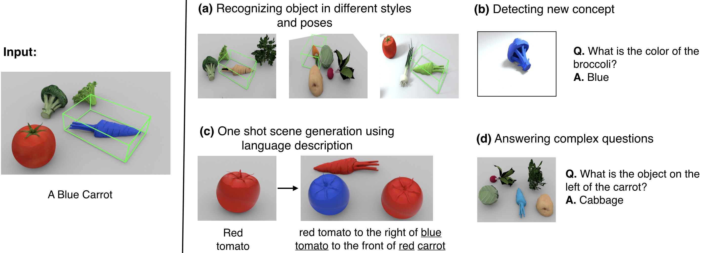

## (On Going) Disentangling 3D Prototypical Networks For Few-Shot Concept Learning
#### ICLR Paper: https://arxiv.org/abs/2011.03367
#### Project Page: https://mihirp1998.github.io/project_pages/d3dp/





### Installation

```
conda env create -f environment.yml
```

### Dataset

Download part of the dataset from this [link](https://drive.google.com/file/d/1OXGvOgweSXjJMykRNlglvds-sDfwt0Sa/view?usp=sharing)

Update the [root_location](https://github.com/mihirp1998/Disentangling-3D-Prototypical-Nets/blob/f92a9a14ba7e414735facdac85e8d0c4bffd1ae2/exp_clevr_sta.py#L499) variable with the parent directory of the downloaded dataset


### Training

```
python main.py cs --en trainer_rgb_no_bn_munit_simple_cross_0.1_dsn
```


#### Correspondence

If you want me to prioritize release of something specific, then mail me at mihirp1998.mp@gmail.com 

